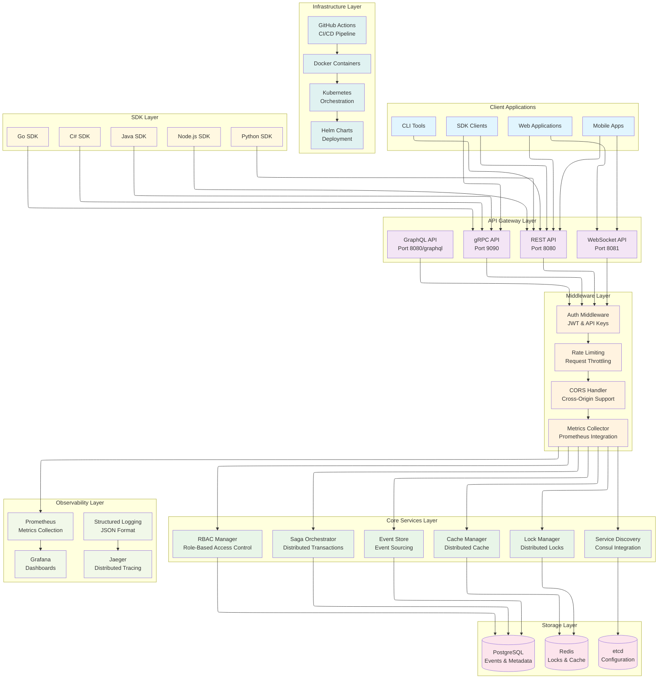
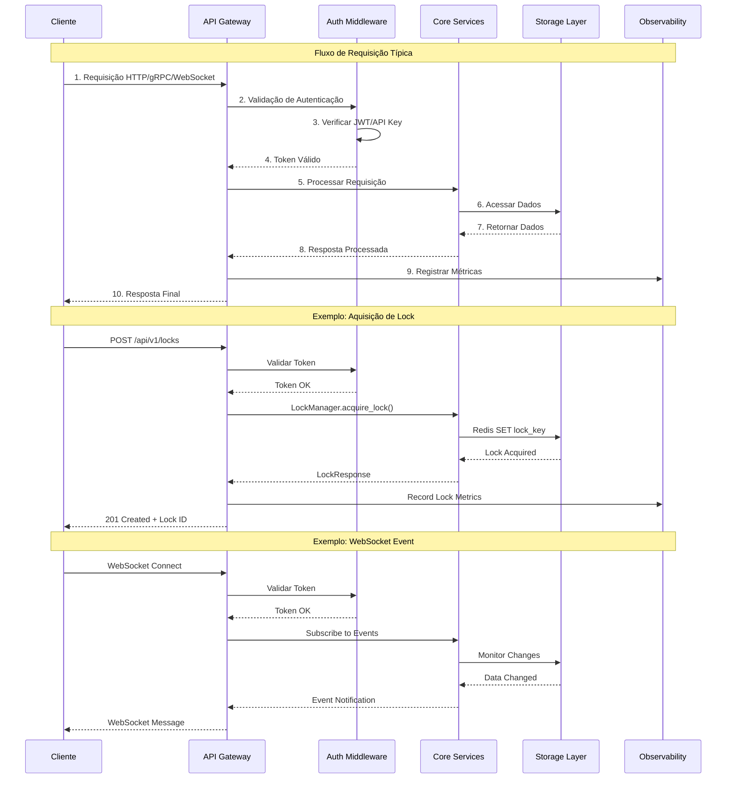
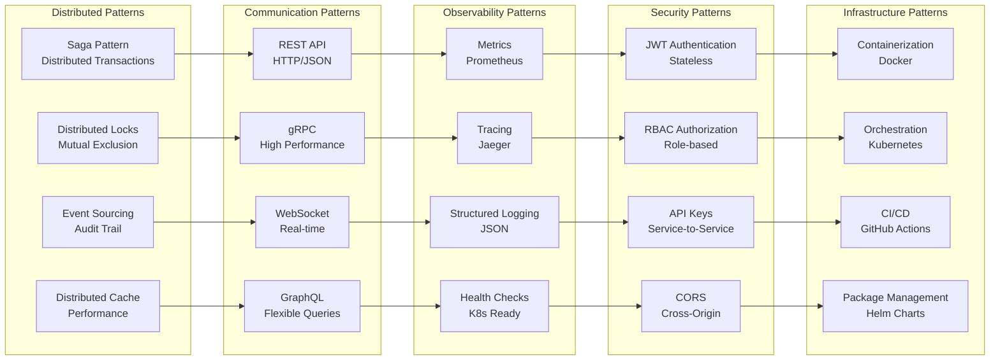

# Syros Platform - Distributed Coordination Service

**Syros** é uma plataforma de coordenação distribuída construída em Rust, oferecendo soluções robustas para sistemas distribuídos modernos.

## Status do Projeto

**PROJETO 100% IMPLEMENTADO E FUNCIONAL!**

### Componentes Implementados

- **Core Engine**: Lock Manager, Saga Orchestrator, Event Store, Cache Manager
- **APIs REST**: Endpoints completos com health checks e métricas
- **gRPC API**: Serviços gRPC completos com Volo
- **WebSocket**: Suporte a conexões WebSocket em tempo real
- **Servidor Flexível**: Seleção de servidores e configuração de IP
- **Configuração**: Sistema de configuração flexível
- **Tratamento de Erros**: Sistema robusto de tratamento de erros
- **Observabilidade**: Métricas Prometheus e tracing
- **Segurança**: JWT e API Keys
- **SDKs**: SDKs para Python, Node.js, Java, C# e Go
- **Docker**: Configuração completa para deployment
- **CI/CD**: Pipelines GitHub Actions
- **Testes**: Cliente de teste funcional

## Arquitetura da Plataforma

### Big Picture - Visão Geral da Arquitetura



### Fluxo de Dados e Interações



### Padrões de Arquitetura Implementados



## Documentação

A documentação completa está disponível na pasta [`docs/`](docs/):

- **[Guia de Início Rápido](docs/getting-started.md)** - Instalação e primeiros passos
- **[REST API](docs/rest-api.md)** - Documentação completa da API REST
- **[gRPC API](docs/grpc-api.md)** - Interface gRPC de alta performance
- **[WebSocket API](docs/websocket-api.md)** - Comunicação em tempo real
- **[GraphQL API](docs/graphql-api.md)** - Interface GraphQL flexível
- **[SDKs](docs/sdks.md)** - SDKs para Python, Node.js, Java, C#, Go
- **[Observabilidade](docs/observability.md)** - Monitoramento e métricas
- **[Arquitetura](docs/architecture.md)** - Visão geral da arquitetura
- **[Configuração](docs/configuration.md)** - Configuração avançada
- **[Deployment](docs/deployment.md)** - Guias de deployment
- **[FAQ](docs/faq.md)** - Perguntas frequentes

### Início Rápido

```bash
# 1. Clone e compile
git clone https://github.com/syros/platform.git
cd platform
cargo build --release

# 2. Inicie o servidor
cargo run

# 3. Teste a API
curl http://localhost:8080/health
```

### APIs Disponíveis

- **REST API**: `http://localhost:8080` - Interface HTTP completa
- **gRPC API**: `localhost:9090` - Interface de alta performance
- **WebSocket**: `ws://localhost:8081` - Comunicação em tempo real
- **GraphQL**: `http://localhost:8080/graphql` - Consultas flexíveis

## Contribuindo

1. Fork o projeto
2. Crie uma branch para sua feature (`git checkout -b feature/AmazingFeature`)
3. Commit suas mudanças (`git commit -m 'Add some AmazingFeature'`)
4. Push para a branch (`git push origin feature/AmazingFeature`)
5. Abra um Pull Request

## Licença

Este projeto está licenciado sob a Licença MIT - veja o arquivo [LICENSE](LICENSE) para detalhes.

## Agradecimentos

- [Rust](https://www.rust-lang.org/) - Linguagem de programação
- [Tokio](https://tokio.rs/) - Runtime assíncrono
- [Axum](https://github.com/tokio-rs/axum) - Framework web
- [Tonic](https://github.com/hyperium/tonic) - Framework gRPC
- [Redis](https://redis.io/) - Cache e locks
- [PostgreSQL](https://www.postgresql.org/) - Banco de dados
- [Prometheus](https://prometheus.io/) - Métricas
- [Grafana](https://grafana.com/) - Dashboards