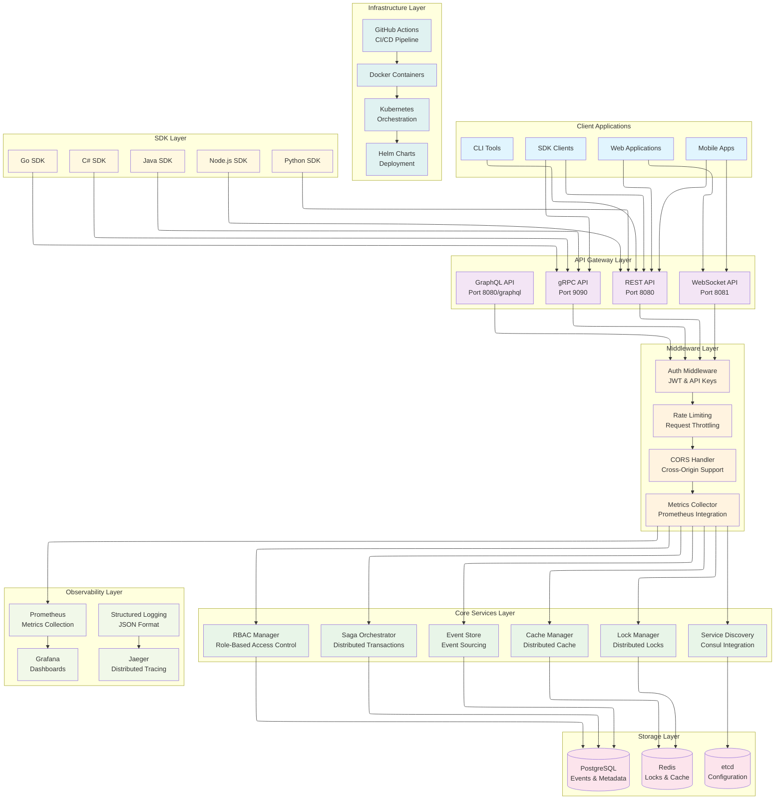
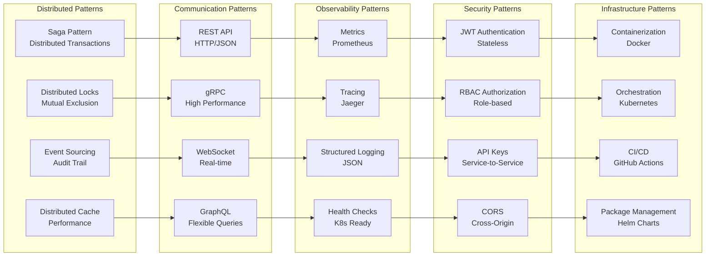

# Syros - Distributed Coordination Service

**Syros** is a distributed coordination platform built in Rust, offering robust solutions for modern distributed systems.

## Project Status

**PROJECT 100% IMPLEMENTED AND FUNCTIONAL!**

### Implemented Components

- **Core Engine**: Lock Manager, Saga Orchestrator, Event Store, Cache Manager
- **REST APIs**: Complete endpoints with health checks and metrics
- **gRPC API**: Complete gRPC services with Volo
- **WebSocket**: Real-time WebSocket connection support
- **Flexible Server**: Server selection and IP configuration
- **Configuration**: Flexible configuration system
- **Error Handling**: Robust error handling system
- **Observability**: Prometheus metrics and tracing
- **Security**: JWT and API Keys
- **SDKs**: SDKs for Python, Node.js, Java, C#, and Go
- **Docker**: Complete deployment configuration
- **CI/CD**: GitHub Actions pipelines
- **Tests**: Functional test client

## Platform Architecture

### Big Picture - Architecture Overview



### Data Flow and Interactions


### Implemented Architecture Patterns



## Documentation

Complete documentation is available in the [`docs/`](docs/) folder:

- **[Quick Start Guide](docs/getting-started.md)** - Installation and first steps
- **[REST API](docs/rest-api.md)** - Complete REST API documentation
- **[gRPC API](docs/grpc-api.md)** - High-performance gRPC interface
- **[WebSocket API](docs/websocket-api.md)** - Real-time communication
- **[GraphQL API](docs/graphql-api.md)** - Flexible GraphQL interface
- **[SDKs](docs/sdks.md)** - SDKs for Python, Node.js, Java, C#, Go
- **[Observability](docs/observability.md)** - Monitoring and metrics
- **[Architecture](docs/architecture.md)** - Architecture overview
- **[Configuration](docs/configuration.md)** - Advanced configuration
- **[Deployment](docs/deployment.md)** - Deployment guides
- **[FAQ](docs/faq.md)** - Frequently asked questions

### Quick Start

```bash
# 1. Clone and build
git clone https://github.com/wendelmax/syros.git
cd syros
cargo build --release

# 2. Start the server
cargo run

# 3. Test the API
curl http://localhost:8080/health
```

### Available APIs

- **REST API**: `http://localhost:8080` - Complete HTTP interface
- **gRPC API**: `localhost:9090` - High-performance interface
- **WebSocket**: `ws://localhost:8081` - Real-time communication
- **GraphQL**: `http://localhost:8080/graphql` - Flexible queries

## Contributing

1. Fork the project
2. Create a feature branch (`git checkout -b feature/AmazingFeature`)
3. Commit your changes (`git commit -m 'Add some AmazingFeature'`)
4. Push to the branch (`git push origin feature/AmazingFeature`)
5. Open a Pull Request

## License

This project is licensed under the MIT License - see the [LICENSE](LICENSE) file for details.

## Acknowledgments

- [Rust](https://www.rust-lang.org/) - Programming language
- [Tokio](https://tokio.rs/) - Async runtime
- [Axum](https://github.com/tokio-rs/axum) - Web framework
- [Tonic](https://github.com/hyperium/tonic) - gRPC framework
- [Redis](https://redis.io/) - Cache and locks
- [PostgreSQL](https://www.postgresql.org/) - Database
- [Prometheus](https://prometheus.io/) - Metrics
- [Grafana](https://grafana.com/) - Dashboards