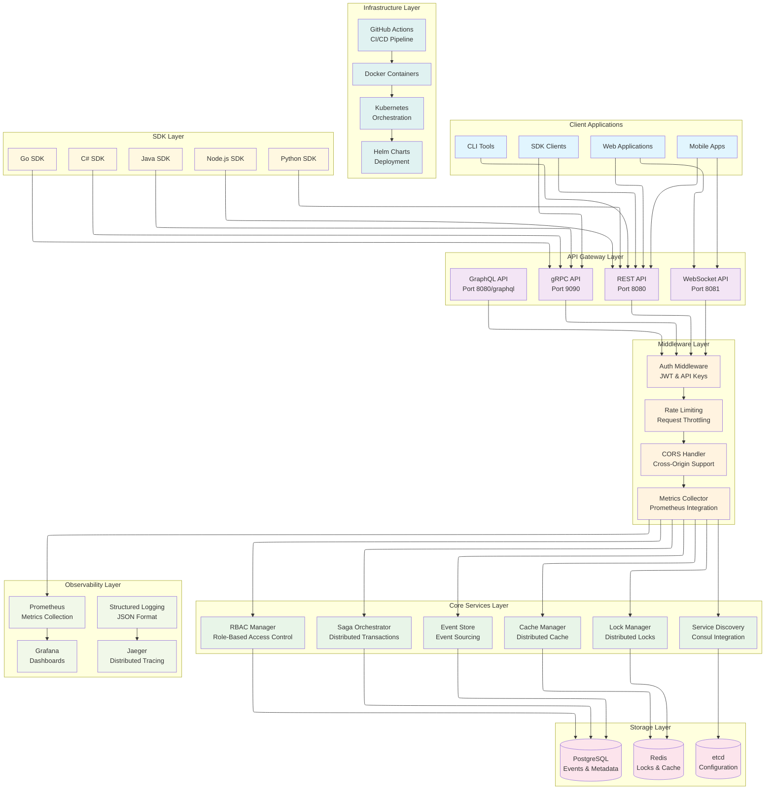
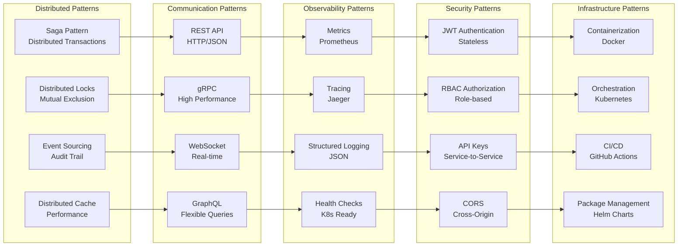

# Platform Architecture

## Big Picture - Architecture Overview

## Data Flow and Interactions

## Implemented Architecture Patterns

## Main Components

### **API Gateway Layer**
- **REST API**: HTTP interface for web integration
- **gRPC API**: High-performance interface for microservices
- **WebSocket API**: Real-time communication
- **GraphQL API**: Flexible interface for complex queries

### **Core Services Layer**
- **Lock Manager**: Distributed lock management
- **Saga Orchestrator**: Distributed transaction orchestration
- **Event Store**: Event storage and replay
- **Cache Manager**: Distributed cache with TTL
- **Service Discovery**: Automatic service discovery
- **RBAC Manager**: Role-based access control

### **Middleware Layer**
- **Auth Middleware**: JWT and API Key authentication
- **Rate Limiting**: Request rate control
- **CORS Handler**: Cross-origin request support
- **Metrics Collector**: Metrics collection for observability

### **Storage Layer**
- **Redis**: Lock and cache storage
- **PostgreSQL**: Event and metadata persistence
- **etcd**: Distributed configuration

### **Observability Layer**
- **Prometheus**: Metrics collection and storage
- **Grafana**: Dashboards and visualizations
- **Jaeger**: Distributed tracing
- **Structured Logging**: JSON structured logs

### **Infrastructure Layer**
- **Docker**: Application containerization
- **Kubernetes**: Container orchestration
- **Helm Charts**: Deployment management
- **GitHub Actions**: CI/CD pipeline

### **SDK Layer**
- **Python SDK**: For Python applications
- **Node.js SDK**: For JavaScript/TypeScript applications
- **Java SDK**: For Java applications
- **C# SDK**: For .NET applications
- **Go SDK**: For Go applications

## Architectural Decisions

### Why Rust?
- **Performance**: Zero-cost abstractions and memory safety
- **Concurrency**: Native async/await with tokio
- **Reliability**: Compile-time bug prevention
- **Ecosystem**: Mature crate ecosystem for distributed systems

### Why Multiple APIs?
- **REST**: Simplicity and universal compatibility
- **gRPC**: Performance and type safety for microservices
- **WebSocket**: Real-time communication
- **GraphQL**: Flexibility for complex frontends

### Why Event Sourcing?
- **Audit**: Complete history of changes
- **Replay**: Ability to rebuild state
- **Debugging**: Problem traceability
- **Integration**: Events as source of truth

### Why Saga Pattern?
- **Distributed Transactions**: Coordination between services
- **Compensation**: Automatic rollback on failure
- **Resilience**: Retry policies and circuit breakers
- **Observability**: Transaction state visibility

## Scalability

### Horizontal Scaling
- **Stateless Services**: Services without internal state
- **Load Balancing**: Automatic load distribution
- **Service Discovery**: Automatic instance discovery
- **Data Partitioning**: Data partitioning by key

### Vertical Scaling
- **Async Processing**: Non-blocking async processing
- **Connection Pooling**: Optimized connection pool
- **Memory Management**: Efficient memory management
- **CPU Optimization**: CPU-specific optimizations

## Security

### Authentication
- **JWT**: Stateless and secure tokens
- **API Keys**: Service-to-service authentication
- **OAuth2**: Integration with external providers
- **mTLS**: Mutual authentication for internal communication

### Authorization
- **RBAC**: Role-based control
- **Permissions**: Granular permissions
- **Resource-based**: Per-resource authorization
- **Time-based**: Automatic permission expiration

### Encryption
- **TLS**: Encrypted communication
- **Data at Rest**: Stored data encryption
- **Key Management**: Secure key management
- **Hashing**: Secure password and token hashing

## Monitoring

### Metrics
- **Business Metrics**: Business metrics
- **Technical Metrics**: Technical metrics
- **Custom Metrics**: Custom metrics
- **Alerting**: Metrics-based alerts

### Logs
- **Structured Logging**: JSON format logs
- **Correlation IDs**: Request tracking
- **Log Levels**: Configurable log levels
- **Log Aggregation**: Centralized aggregation

### Tracing
- **Distributed Tracing**: Distributed tracking
- **Span Correlation**: Span correlation
- **Performance Analysis**: Performance analysis
- **Error Tracking**: Error tracking

## Resilience

### Fault Tolerance
- **Circuit Breakers**: Protection against cascade failures
- **Retry Policies**: Configurable retry policies
- **Timeout Handling**: Timeout handling
- **Graceful Degradation**: Graceful degradation

### Disaster Recovery
- **Backup Strategy**: Backup strategy
- **Data Replication**: Data replication
- **Failover**: Automatic failover
- **Recovery Procedures**: Recovery procedures

---

**Next**: [Configuration](configuration.md) | [Deployment](deployment.md) | [Observability](observability.md)