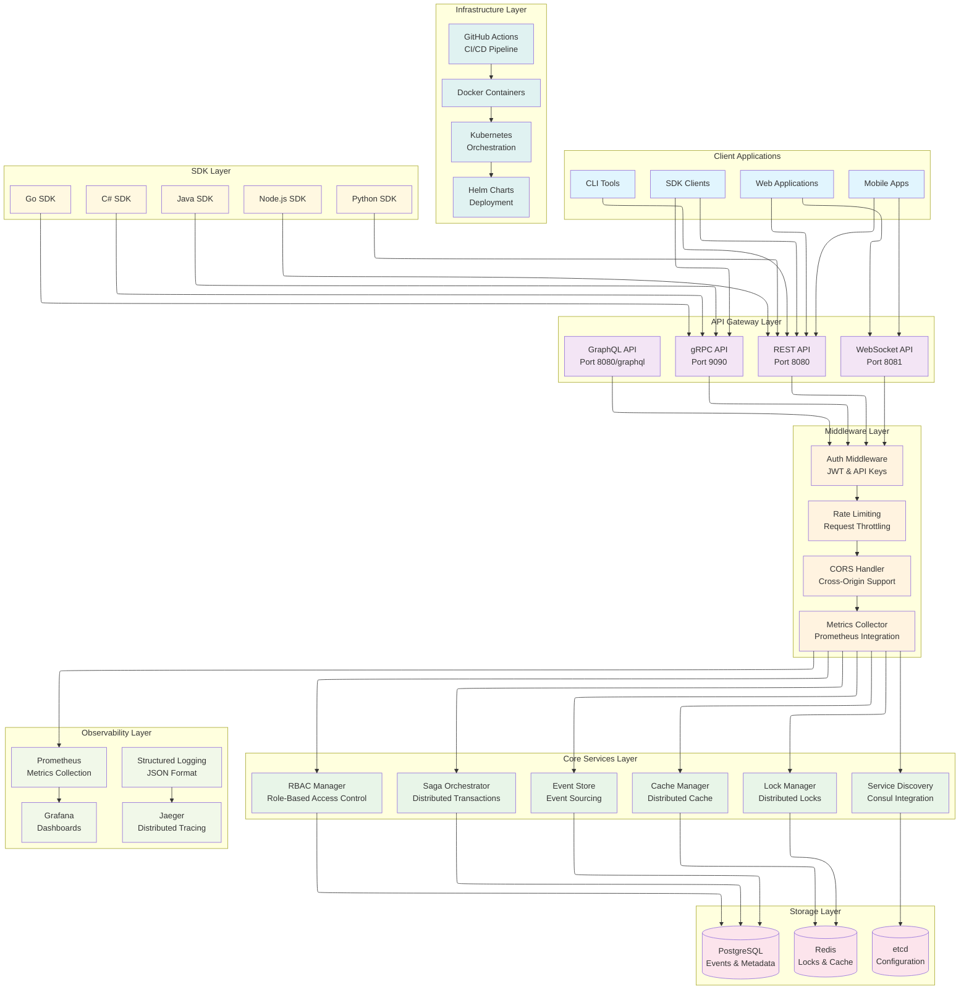
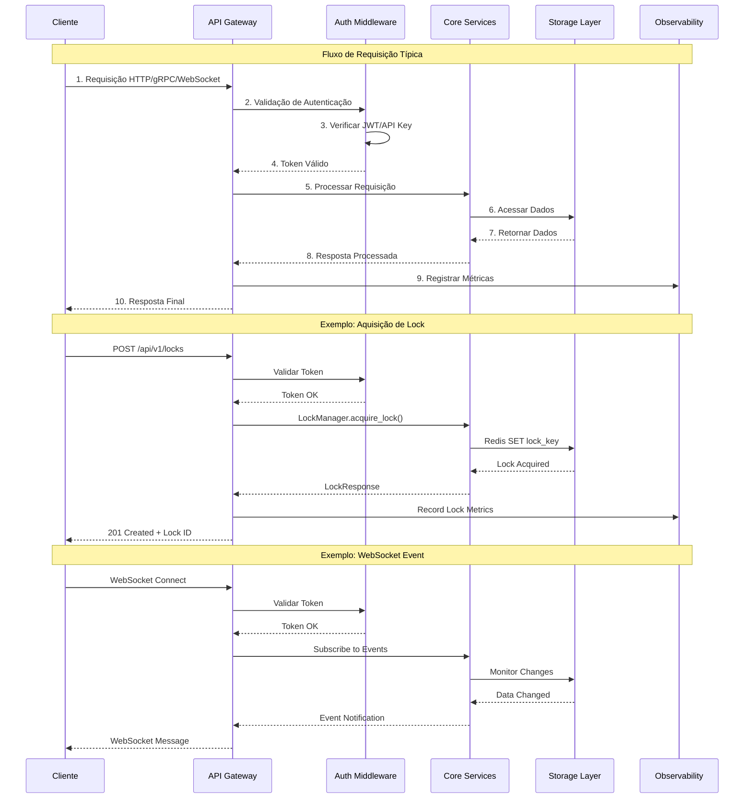
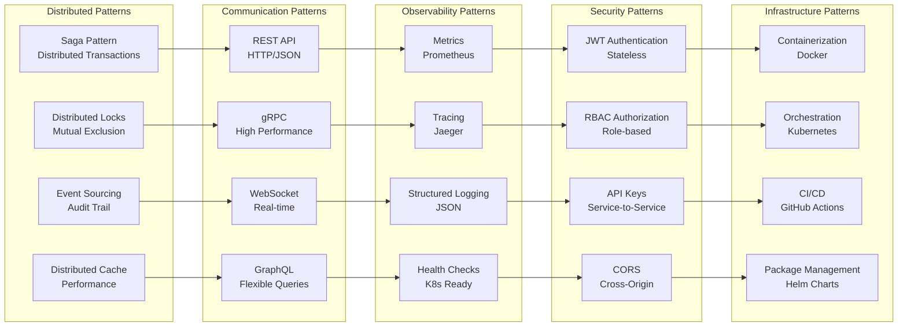

# Arquitetura da Plataforma

## Big Picture - Visão Geral da Arquitetura

## Fluxo de Dados e Interações

## Padrões de Arquitetura Implementados

## Componentes Principais

### **API Gateway Layer**
- **REST API**: Interface HTTP para integração web
- **gRPC API**: Interface de alta performance para microserviços
- **WebSocket API**: Comunicação em tempo real
- **GraphQL API**: Interface flexível para consultas complexas

### **Core Services Layer**
- **Lock Manager**: Gerenciamento de locks distribuídos
- **Saga Orchestrator**: Orquestração de transações distribuídas
- **Event Store**: Armazenamento e replay de eventos
- **Cache Manager**: Cache distribuído com TTL
- **Service Discovery**: Descoberta automática de serviços
- **RBAC Manager**: Controle de acesso baseado em roles

### **Middleware Layer**
- **Auth Middleware**: Autenticação JWT e API Keys
- **Rate Limiting**: Controle de taxa de requisições
- **CORS Handler**: Suporte a requisições cross-origin
- **Metrics Collector**: Coleta de métricas para observabilidade

### **Storage Layer**
- **Redis**: Armazenamento de locks e cache
- **PostgreSQL**: Persistência de eventos e metadados
- **etcd**: Configuração distribuída

### **Observability Layer**
- **Prometheus**: Coleta e armazenamento de métricas
- **Grafana**: Dashboards e visualizações
- **Jaeger**: Rastreamento distribuído
- **Structured Logging**: Logs estruturados em JSON

### **Infrastructure Layer**
- **Docker**: Containerização da aplicação
- **Kubernetes**: Orquestração de containers
- **Helm Charts**: Gerenciamento de deployments
- **GitHub Actions**: Pipeline de CI/CD

### **SDK Layer**
- **Python SDK**: Para aplicações Python
- **Node.js SDK**: Para aplicações JavaScript/TypeScript
- **Java SDK**: Para aplicações Java
- **C# SDK**: Para aplicações .NET
- **Go SDK**: Para aplicações Go

## Decisões Arquiteturais

### Por que Rust?
- **Performance**: Zero-cost abstractions e memory safety
- **Concorrência**: Async/await nativo com tokio
- **Confiabilidade**: Prevenção de bugs em tempo de compilação
- **Ecosistema**: Crate ecosystem maduro para sistemas distribuídos

### Por que Múltiplas APIs?
- **REST**: Simplicidade e compatibilidade universal
- **gRPC**: Performance e type safety para microserviços
- **WebSocket**: Comunicação em tempo real
- **GraphQL**: Flexibilidade para frontends complexos

### Por que Event Sourcing?
- **Auditoria**: Histórico completo de mudanças
- **Replay**: Capacidade de reconstruir estado
- **Debugging**: Rastreabilidade de problemas
- **Integração**: Eventos como fonte de verdade

### Por que Saga Pattern?
- **Transações Distribuídas**: Coordenação entre serviços
- **Compensação**: Rollback automático em caso de falha
- **Resiliência**: Retry policies e circuit breakers
- **Observabilidade**: Visibilidade do estado das transações

## Escalabilidade

### Horizontal Scaling
- **Stateless Services**: Serviços sem estado interno
- **Load Balancing**: Distribuição de carga automática
- **Service Discovery**: Descoberta automática de instâncias
- **Data Partitioning**: Particionamento de dados por chave

### Vertical Scaling
- **Async Processing**: Processamento assíncrono não-bloqueante
- **Connection Pooling**: Pool de conexões otimizado
- **Memory Management**: Gerenciamento eficiente de memória
- **CPU Optimization**: Otimizações específicas para CPU

## Segurança

### Autenticação
- **JWT**: Tokens stateless e seguros
- **API Keys**: Autenticação service-to-service
- **OAuth2**: Integração com provedores externos
- **mTLS**: Autenticação mútua para comunicação interna

### Autorização
- **RBAC**: Controle baseado em roles
- **Permissions**: Permissões granulares
- **Resource-based**: Autorização por recurso
- **Time-based**: Expiração automática de permissões

### Criptografia
- **TLS**: Comunicação criptografada
- **Data at Rest**: Criptografia de dados armazenados
- **Key Management**: Gerenciamento seguro de chaves
- **Hashing**: Hash seguro de senhas e tokens

## Monitoramento

### Métricas
- **Business Metrics**: Métricas de negócio
- **Technical Metrics**: Métricas técnicas
- **Custom Metrics**: Métricas personalizadas
- **Alerting**: Alertas baseados em métricas

### Logs
- **Structured Logging**: Logs em formato JSON
- **Correlation IDs**: Rastreamento de requisições
- **Log Levels**: Níveis de log configuráveis
- **Log Aggregation**: Agregação centralizada

### Tracing
- **Distributed Tracing**: Rastreamento distribuído
- **Span Correlation**: Correlação de spans
- **Performance Analysis**: Análise de performance
- **Error Tracking**: Rastreamento de erros

## Resiliência

### Fault Tolerance
- **Circuit Breakers**: Proteção contra falhas em cascata
- **Retry Policies**: Políticas de retry configuráveis
- **Timeout Handling**: Tratamento de timeouts
- **Graceful Degradation**: Degradação graciosa

### Disaster Recovery
- **Backup Strategy**: Estratégia de backup
- **Data Replication**: Replicação de dados
- **Failover**: Failover automático
- **Recovery Procedures**: Procedimentos de recuperação

---

**Próximo**: [Configuração](configuration.md) | [Deployment](deployment.md) | [Observabilidade](observability.md)
